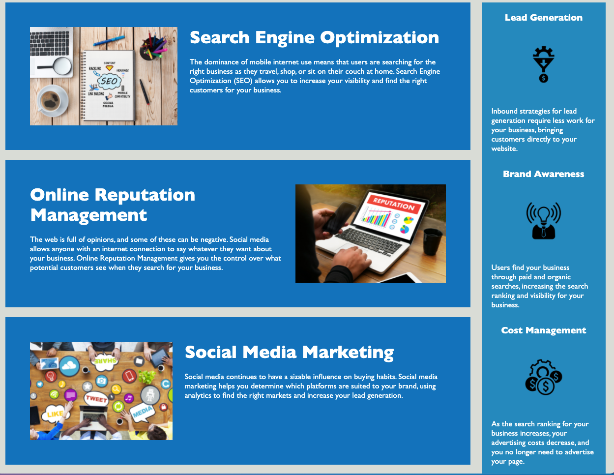

# accessible_develop

The goal for this client is to have an accessible website that uses semantic elements in a quality structure. It has sequential headings and a new title. 

I changed the title to Horiseon. Then I changed several div tags to more specific and semantic elements like header, nav, aside, and footer and changed the corresponding css when appropriate. I added alt codes for all images in the html. 

I also consolidated styling for several elements that all had the same style tags. 

## Features

This project required keeping the visiual layout exactly the same, while cleaning up the code. So this site continues to look as it did before. 

## Built With

* [HTML](https://developer.mozilla.org/en-US/docs/Web/HTML)
* [CSS](https://developer.mozilla.org/en-US/docs/Web/CSS)

## Deployed Link

[See the live site](https://lauragupta.github.io/accessible_develop/)

## Credits

This site required a lot of research from W3schools including https://www.w3schools.com/html/html5_semantic_elements.asp

## Author

* **Laura Gupta** 

- [Link to Github] (https://lauragupta.github.io/prework-about-me/)
- [Link to LinkedIn] (https://www.linkedin.com/in/laura-gupta-5a277158/)

## License

MIT License

Copyright (c) [2021] [Laura Gupta]

Permission is hereby granted, free of charge, to any person obtaining a copy
of this software and associated documentation files (the "Software"), to deal
in the Software without restriction, including without limitation the rights
to use, copy, modify, merge, publish, distribute, sublicense, and/or sell
copies of the Software, and to permit persons to whom the Software is
furnished to do so, subject to the following conditions:

The above copyright notice and this permission notice shall be included in all
copies or substantial portions of the Software.

THE SOFTWARE IS PROVIDED "AS IS", WITHOUT WARRANTY OF ANY KIND, EXPRESS OR
IMPLIED, INCLUDING BUT NOT LIMITED TO THE WARRANTIES OF MERCHANTABILITY,
FITNESS FOR A PARTICULAR PURPOSE AND NONINFRINGEMENT. IN NO EVENT SHALL THE
AUTHORS OR COPYRIGHT HOLDERS BE LIABLE FOR ANY CLAIM, DAMAGES OR OTHER
LIABILITY, WHETHER IN AN ACTION OF CONTRACT, TORT OR OTHERWISE, ARISING FROM,
OUT OF OR IN CONNECTION WITH THE SOFTWARE OR THE USE OR OTHER DEALINGS IN THE
SOFTWARE.